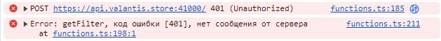
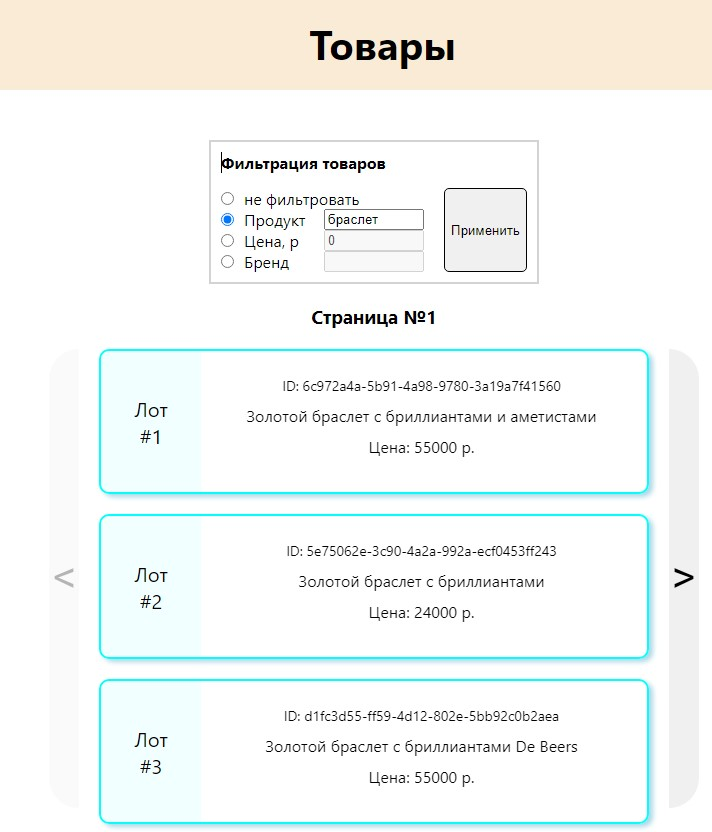

# Тестовое задание для Valantis

### 1. Описание задания:

Используя предоставленный апи создать страницу, которая отображает список товаров.
Для каждого товара должен отображаться его id, название, цена и бренд.

- выводить по 50 товаров на страницу с возможностью постраничного перехода (пагинация) в обе стороны.
- возможность фильтровать выдачу используя предоставленное апи по названию, цене и бренду

Если API возвращает дубли по id, то следует их считать одним товаром и выводить только первый, даже если другие поля различаются. Если API возвращает ошибку, следует вывести идентификатор ошибки в консоль, если он есть и повторить запрос.

Задание можно выполнять на **React** или на **нативном JS**.
Оцениваться будет правильность работы сайта и качество кода.

### 2. Ссылка на выполненное задание

- ##### https://streltsov-do.github.io/valantis/

### 3. Описание приложения

Сайт представляет собой SPA, написанное на фреймворке React.

- При заходе на сайт начинается загрузка данных и показывается лоадер:

- После успешно выполненного запроса выводятся карточки продуктов с ID товара, названием, ценой и брендом (если он есть)

- Пример карточки с брендом

  

- При неуспешном выполнении запроса в консоль будет выведено сообщение с названием функции, кодом ошибки и сообщением от сервера. При отсутствии сообщения - будет выводиться "нет сообщения от сервера":

  

- Можно отфильтровать товары по выбранному фильтру. Для этого нужно выбрать категорию фильтрации, указать параметр фильтрации и нажать кнопку применить:

  

- Пример фильтрации по продукту:

  

- Пример фильтрации по цене:

  

- Пример фильтрации по бренду 

  

- При количестве товаров больше 50 - будет возможность перейти на следующую страницу:

  

  

- При нахождении на последней/первой странице - кнопка перехода вперёд/назад будет заблокирована:

  

- При ширине экрана меньше 685 пикселей - применяется мобильная версия

  

